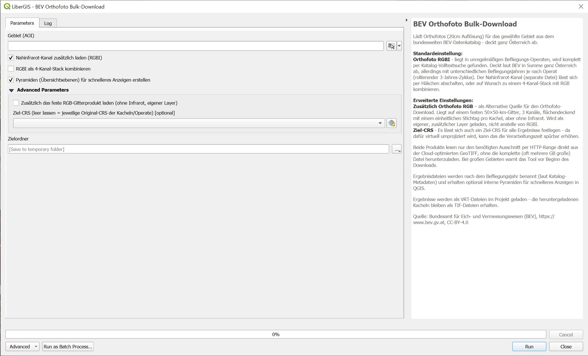

# BEV Orthofoto Bulk-Download

A QGIS Processing script that bulk-downloads orthophoto (aerial imagery) tiles from the official BEV (Bundesamt für Eich- und Vermessungswesen) nationwide data catalog for a chosen area, anywhere in Austria, and adds ready-to-use mosaic layers straight to your project.

> **Note:** The tool's interface (parameter labels, log messages, help text) is in German, matching its target audience. This README is in English for discoverability.

## What it does

Given an area of interest anywhere in Austria, this tool:

- Fetches **Orthofoto RGBI** (true colour + near-infrared, 20cm resolution) by default — this product isn't published on a fixed grid but in irregular flight "Operate", found via a full-text catalog search and a local overlap check against your area. RGB and infrared arrive as separate files; the infrared channel can be switched off, or combined with RGB into a single 4-band stack.
- Optionally, under "Advanced Parameters", also fetches **Orthofoto RGB** (true colour only, 20cm) from BEV's fixed 50×50 km nationwide grid — no infrared, but a single consistent capture date per tile. Loaded as an additional, separate layer alongside RGBI, not instead of it.
- Reads only the actual bytes it needs via HTTP range requests directly from BEV's Cloud-Optimized GeoTIFFs (`/vsicurl/`), instead of downloading the full file — relevant since a single tile or flight can be several GB. Falls back to downloading (and locally caching) the complete file only if the windowed read fails for some reason.
- Warns before starting if the chosen area is very large, given how quickly data volume grows at 20cm resolution.
- Builds a lightweight VRT mosaic per product (no pixel duplication on disk) and adds it directly to your QGIS project — including the 4-band stack and an optional target-CRS reprojection, both of which are also delivered as a VRT rather than a materialized copy.
- Optional pyramids (overviews) for faster display in QGIS.
- Optional on-the-fly reprojection, under "Advanced Parameters", to a target CRS of your choice, via a standard CRS picker — can noticeably increase processing time, since this virtually reprojects rather than copying pixels.
- Cancellable mid-run; failed tiles/Operate are reported in the log rather than silently skipped.

## Installation

This is a single-file **Processing script**, not a full plugin:

1. Download [`bev_orthofoto_bulk_download.py`](https://github.com/preinzi/qgis-bev-orthofoto-download/blob/main/bev_orthofoto_bulk_download.py).
2. In QGIS: **Processing → Toolbox → Scripts (gear icon) → Add Script to Toolbox…**, and select the file.
3. It will appear under **Skripte/Scripts → LiberGIS → BEV Orthofoto Bulk-Download**.

No extra Python packages required beyond what ships with QGIS (uses only the Python standard library plus the bundled GDAL/PyQGIS). Tested on QGIS 3.44 LTR (Windows).

## Usage

| Parameter | Description |
| --- | --- |
| **Gebiet (AOI)** | Area of interest, anywhere in Austria — draw a rectangle, use the current canvas extent or calculate extent from a layer |
| **Nahinfrarot-Kanal zusätzlich laden (RGBI)** | Whether to also fetch the near-infrared channel of the RGBI product (default: on) |
| **RGBI als 4-Kanal-Stack kombinieren** | Combine RGB and infrared into a single 4-band layer instead of two separate ones (default: off) |
| **Pyramiden (Übersichtsebenen) für schnelleres Anzeigen erstellen** | Build overviews for faster display in QGIS (default: on) |
| **Zielordner** | Where downloaded tiles and mosaics are stored. Recommended to use a persistent folder — results stay usable after the QGIS session ends, and a later run over an overlapping area reuses already-downloaded pieces |
| **Zusätzlich das feste RGB-Gitterprodukt laden** *(Advanced)* | Also fetch the fixed-grid RGB-only product as an additional layer |
| **Ziel-CRS** *(Advanced)* | Optional. Leave empty to keep each product's own native CRS; pick a CRS to get a virtually reprojected VRT for every result — can noticeably increase processing time |

### Output layers

For RGBI, one or two layers are added (`DOP_RGBI_RGB_<years>` and, if infrared is enabled, `DOP_RGBI_NIR_<years>` — or a single `DOP_RGBI_Stack_<years>` if the 4-channel stack option is used). If the additional grid RGB product is enabled, one more layer (`DOP_RGB_<year>`) is added. On disk, each product gets its own subfolder under the chosen output folder, containing the individual downloaded pieces plus a `.vrt` mosaic (and, if a target CRS was chosen, an additional reprojected `.vrt`).

## Data source

Quelle: Bundesamt für Eich- und Vermessungswesen (BEV), <https://www.bev.gv.at>, CC-BY-4.0

## License

GPL-3.0-or-later — see [LICENSE](https://github.com/preinzi/qgis-bev-orthofoto-download/blob/main/LICENSE).

## Credits

Written by Stephan Preinstorfer (LiberGIS) with help from Claude (Anthropic).

## Contributing

Issues and pull requests welcome.
